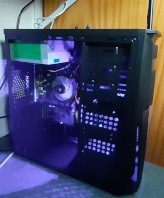
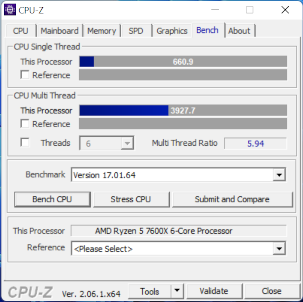
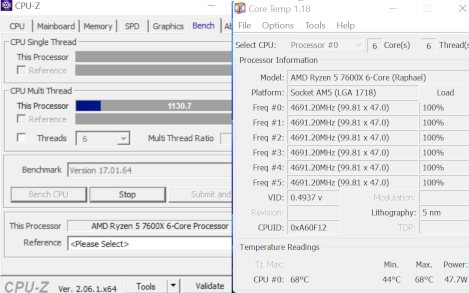

# 7600X
I wanted to get maximal single core performamce for not too much money, and used
Passmark [Single Thread Performance](https://www.cpubenchmark.net/singleThread.html) list for investigation.
I found some not that expensive above 4,000 Thread Mark, but 7600X with 4,221 was best price/performance.

|           |Rank|CPU Name            |Core |Turbo |Cores|CPU Mark|Thread Mark|             |
|-----------|---:|--------------------|---------:|----------:|----:|-------:|----------:|-------------|
|           |    |                    |     [MHz]|      [MHz]|     |[Million Operations/s]|[Million Operations/s]| |
|      Pi400|3513|      ARM Cortex-A72|      1800|        N/A|4    |     769|        542|             |
|     laptop| 407|Intel Core i7-11850H|      2500|       4800|8    |  20,833|      3,152|             |
|           |    |                    |          |           |     |        |           |             |
|workstation| 290|Intel Core i7-11700K|      3600|       5000|8    |  24,670|      3,422|of older son |
|           |    |                    |          |           |     |        |           |             |
|     new PC|  18|AMD Ryzen 5 7600X   |      4700|       5300|6    |  28,969|      4,221|             |
|           |    |                    |          |           |     |  19,506|      3,690|seen @4.7GHz |

## new PC
AMD Ryzen 5 7600X PC came with Win11 preinstalled on a 240GB SATA SSD.  
I decided to keep that for being able to compare performance of Win11 with Ubunutu 22.04 Server on identical hardware and Bios settings.
I installed Ubuntu 22.04 server on an external "SanDisk Extreme Pro USB 3.1 Solid Flash Drive" for now.

### Concept of operations
I switched to Linux at work 16 years agon, at home even earlier.
Therefore I have no experience in how to make Win11 secure, and decided to block internet access for new PC in cable router. So my Win11 will never get internet access again (it likely had internet access at company where I bought it, during installation of Win11).  

In case new PC Ubuntu needs internet access (eg. to install new stuff), I enable internet access in cable router, install and then disable internet access gain.  

For installing new software on Win11, I download install package on my Pi400 into ```~/win11``` directory, and run ```python -m http.server``` there then.
On Win11 I open ```http://127.0.0.1:8000``` in Edge browser (never used that before), download from there and install.

New PC has Lan access, and I created some screenshots on Win11 side with installed "snipping tool". For now I did reboot new PC into Linux, mount the big Win11 NTFS partition and copy files to my Pi400 with ```scp```. That way the screenshots in this repo came into place. I might install WinSCP to make that copying easier.

### Details of PC


I searched for "office PC 7600X" on German ebay, and found this as cheapest with 7600X CPU (487€ or 532$): https://www.ebay.de/itm/195733279470  


Minimal parts: AMD Ryzen 5 7600X CPU, ASRock A620M-HDV/M.2 mainboard, 8GB DDR5-4800 RAM, 240GB SSD, integrated graphics, ...  
Minimal because I did not know what might be important, and high single core integer performannce for factoring very big numbers might not need more (also for my https://github.com/Hermann-SW/RSA_numbers_factored).

I never bought a CPU only 9 months after launch date before ... current price of CPU is 50% of total PC price:  
https://www.amd.com/en/products/cpu/amd-ryzen-5-7600x


## Passmark

### Win11 screenshots
[Single Thread](res/single.PNG)  
[CPU Mark](res/cpu_mark.PNG)  

### 7600X OS comaprison

These numbers were determined with PassMark GUI application for Win11, and 64bit Linux command line app for Ubuntu. Same Bios settings (SMT and SVM disabled, no PBO), same PC. I have no idea yet why some numbers are so different between both OSes, for "the same" PassMark software.

|                 | Ubuntu 22.04 | | Win11 | |
|-----------------|--------------|-|-------|-|
|                 | pt_linux_x64 -r 1 | | (GUI) CPU MARK|
| CPU_INTEGER_MATH| 45436.9 | | 45188 | Million Operations/s |
| CPU_FLOATINGPOINT_MATH| 40944.2 |<| 42643 | Million Operations/s |
| CPU_PRIME| 167.7 |<<| 227 | Million Primes/s |
| CPU_SORTING| 27179.5 |<| 28144 | Thousand Strings/s |
| CPU_ENCRYPTION| 10110.3 |>| 9267 | MB/s |
| CPU_COMPRESSION| 199937.7 | | 198128 | KB/s |
| CPU_SINGLETHREAD| 3690.2 | | 3703 | Million Operations/s |
| CPU_PHYSICS| 2080.4 |>>| 1619 | Frames/s | 
| CPU_MATRIX_MULT_SSE| 18412.6 |<<| 20983 | Million Matrices/s |


## CPU-Z

Bench on left side shows near optimal Multi Thread Ratio of 6.  
Stress CPU on right after 30 minutes shows maximal CPU temperature less than 70°C.  
   

## PARI/GP

I had huge problems with PARI/GP on Ubuntu 22.04 server on 7600X CPU (not on Win11 on 7600X):  
httphttps://www.amazon.de/dp/B0B25NTRGD?s://pari.math.u-bordeaux.fr/archives/pari-users-2306/msg00095.html  

All problems are gone after installing Ubuntu 22.04 Desktop on a fast SSD (history: [problem PARI/GP section](ubuntu_server.parigp.problem.md)).  
([Crucial P3 Plus 500GB M.2 NVMe SSD](https://www.amazon.de/dp/B0B25NTRGD) for 28.56€ or 31.20$).


I compiled PARI/GP from source "Stable version: pari-2.15.3.tar.gz (4.9 MB), Mar 14 2023" for Ubuntu and RHEL.
I installed "Stable 64-bit version: Pari64-2-15-3.exe (97.9 MB), Mar 14 2023" on Win11.

I used https://github.com/Hermann-SW/RSA_numbers_factored/blob/main/pari/sqrtm1.gp for computing ```sqrt(-1) (mod p)```
for 10,000-/36,401-/100,355-digit primes.

I had this in ```gprc``` for all OSes:  
```
...
parisizemax = 2G
parisize = 2G
...
```

|#digits of prime|(Win11)|Ubuntu 22.04 |RHEL 8.7||
|-:|-:|-:|-:|-|
||(7600X)|7600X|i7-11850H|7600X /<br>i7-11850H |
|10000|(3.0)|2.7|3.0|90%|
|36401|(70.5)|65.9|74.3|88.7%|
|100355|(660.8)|611.4|708.9|86.2%|
With these measurements I can rule out Win11 for 7600X, since it is 8.0% slower than Ubuntu 22.04 desktop on same CPU plus Bios settings.


I did run 6 ```gp``` on 36,401-digit prime in parallel, nothing else during that time:  
```for((i=1;i<=6;++i)); do  perf stat gp < sqrtm1.gp > out$i 2> err$i & done```

7600X runs at 4.684GHz on all six cores, with runtimes [ms] 65974 / 66008.5 / 66052 (min/avg/max), only slightly longer than 65915ms for single process running:  

```
hermann@7600x:~/RSA_numbers_factored/pari$ grep GHz err?
err1:   309.919.346.018      cycles                    #    4,684 GHz                      (83,34%)
err2:   310.044.500.390      cycles                    #    4,684 GHz                      (83,34%)
err3:   310.427.368.510      cycles                    #    4,684 GHz                      (83,33%)
err4:   310.091.040.427      cycles                    #    4,684 GHz                      (83,34%)
err5:   310.295.693.879      cycles                    #    4,684 GHz                      (83,33%)
err6:   310.013.102.550      cycles                    #    4,684 GHz                      (83,33%)
hermann@7600x:~/RSA_numbers_factored/pari$ grep result out?
out1:  ***   last result computed in 1min, 5,974 ms.
out2:  ***   last result computed in 1min, 5,989 ms.
out3:  ***   last result computed in 1min, 6,033 ms.
out4:  ***   last result computed in 1min, 6,013 ms.
out5:  ***   last result computed in 1min, 6,052 ms.
out6:  ***   last result computed in 1min, 5,990 ms.
hermann@7600x:~/RSA_numbers_factored/pari$
```

```perf stat``` output for 100355-digit prime run on 7600X Ubuntu (currently without PBO=Performance Boost Optimization, with DDR5-4800 RAM):
```
        611.605,71 msec task-clock                #    1,000 CPUs utilized
             8.980      context-switches          #   14,683 /sec
                 0      cpu-migrations            #    0,000 /sec
           244.980      page-faults               #  400,552 /sec
 2.867.129.733.053      cycles                    #    4,688 GHz                      (83,33%)
       187.295.262      stalled-cycles-frontend   #    0,01% frontend cycles idle     (83,33%)
     1.994.163.508      stalled-cycles-backend    #    0,07% backend cycles idle      (83,33%)
 8.797.163.689.795      instructions              #    3,07  insn per cycle
                                                  #    0,00  stalled cycles per insn  (83,33%)
   473.206.111.956      branches                  #  773,711 M/sec                    (83,34%)
     1.187.115.474      branch-misses             #    0,25% of all branches          (83,33%)

     611,688749737 seconds time elapsed

     611,451802000 seconds user
       0,147991000 seconds sys
```

## C++ with libgmpxx

I used https://github.com/Hermann-SW/RSA_numbers_factored/blob/main/c%2B%2B/sqrtm1.cc for computing ```sqrt(-1) (mod p)```
for 10,000-/36,401-/100,355-digit primes here as well. 7600X runtimes [s] are 10%+ better than i7-11850H. Currently without
PBO (Performance Boost Optimization), matching Passmark ratio from above Thread Mark values 3152/3690=85.4%:  

|#digits of prime|Ubuntu 22.04 |RHEL 8.7||
|-:|-:|-:|-:|
||7600X|i7-11850H|7600X /<br>i7-11850H|
|10000|2.5|2.8|89.3%|
|36401|52.5|59.6|88.1%|
|100355|505.4|597.1|84.6%|

